# Team01

### 分配圖
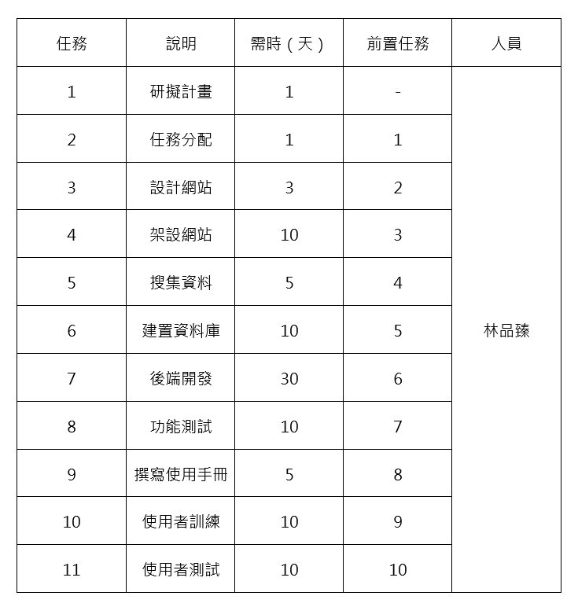

---

### 甘特圖（Ｍermaid）
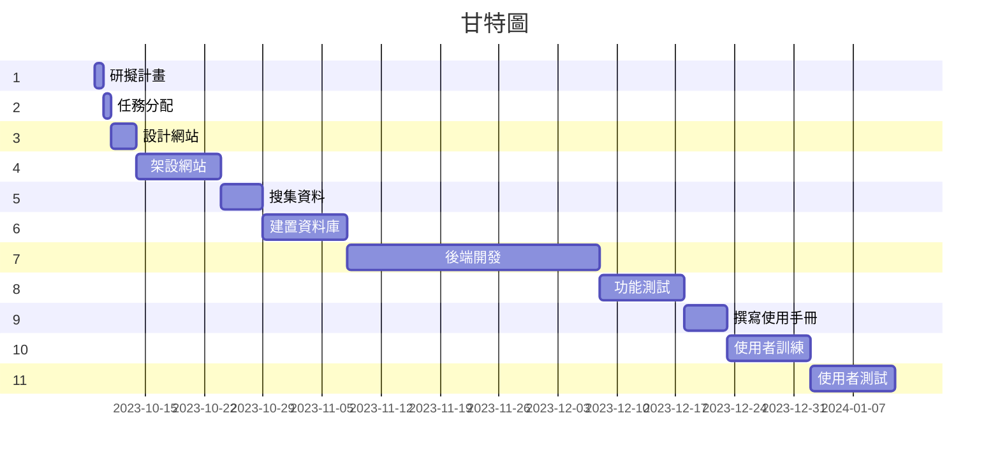
---

### PERT圖
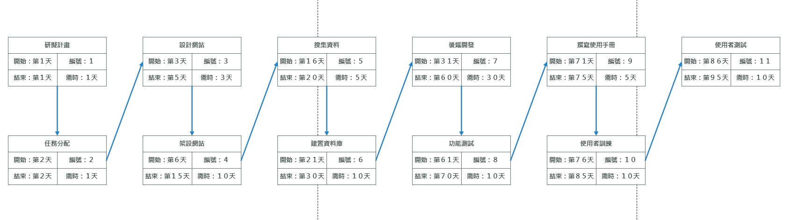

---

### 關鍵路徑：1→2→3→4→5→6→7→8→9→10→11

---

### 功能性需求：試題測驗、會員系統、筆記複習、搜尋功能、題庫管理

### 非功能性需求：易用性、可維護性、可延伸性

---

### 功能分解圖（FDD）
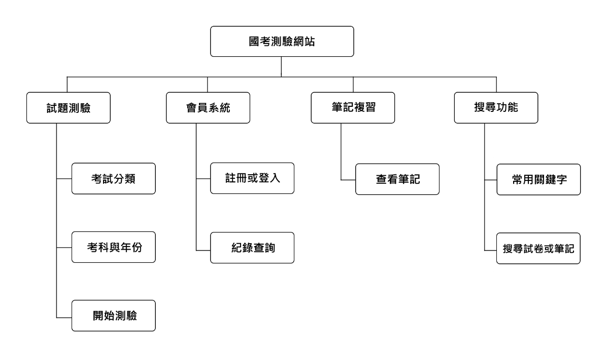

---

### 需求分析

|國考測驗網站的需求分析簡述如下：|
|:----------------------------|
|1. 使用者無需註冊會員即可開始進行測驗|
|2. 使用者藉由會員系統可以留下作答、試卷、筆記等紀錄|
|3. 使用者可於結束測驗後得知正確答案及分數|
|4. 使用者可自行於題目下方增加筆記（註釋或詳解）|
|5. 使用者可透過搜尋功能查詢有關試卷|
|6. 管理者可修改或更新測驗題庫|

---

### 使用案例圖
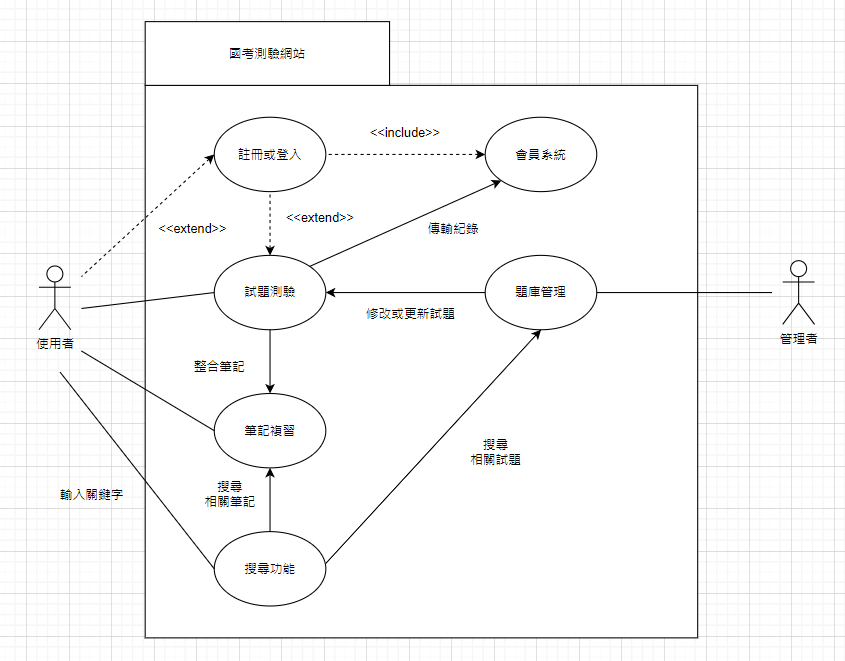

### 案例說明１
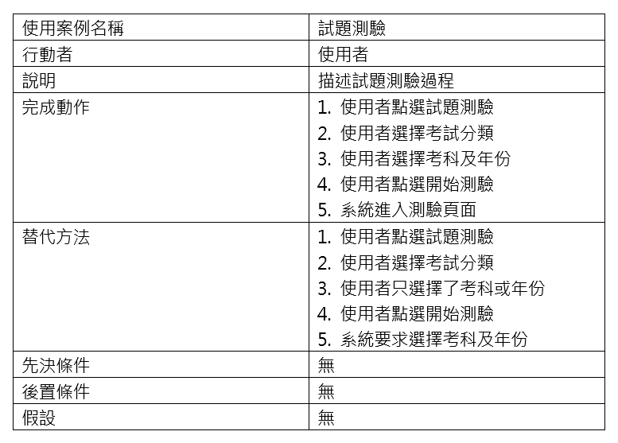

### 案例說明２
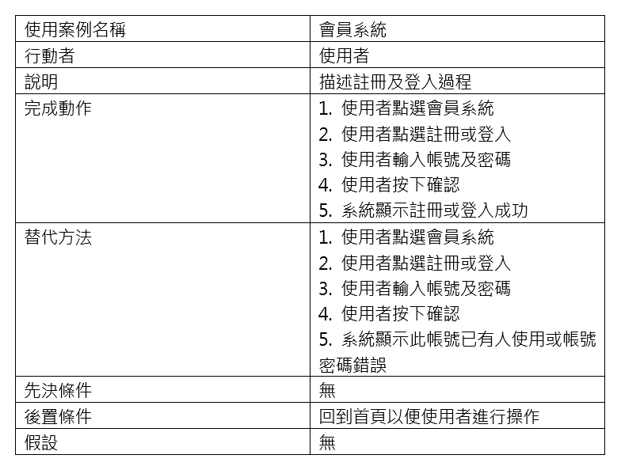

### 案例說明３
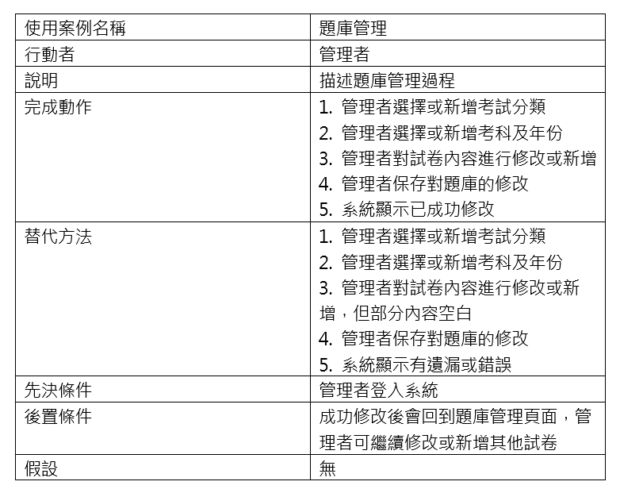

---

### Figma動態模擬畫面
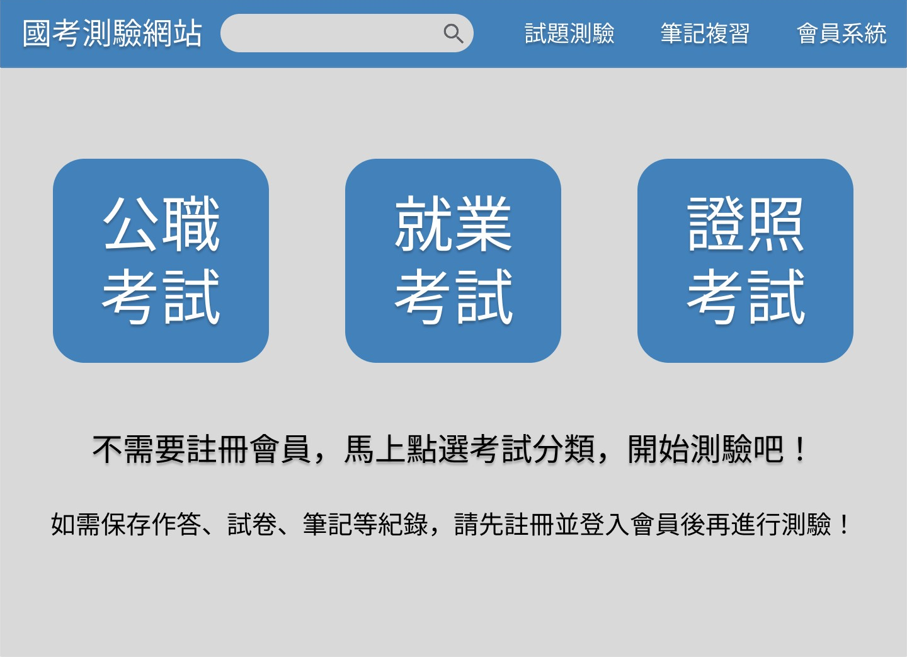

---

### 系統環境圖（DFD）
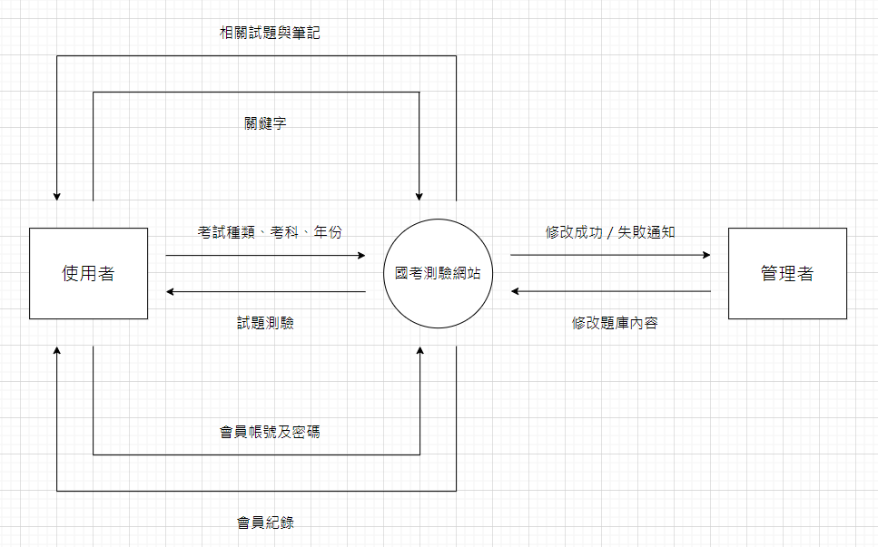

### DFD 圖０

---

### UML 類別圖
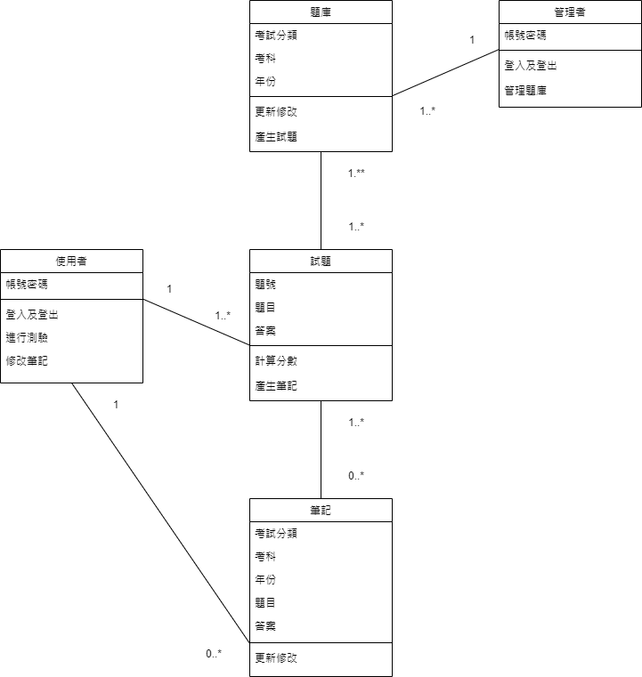
